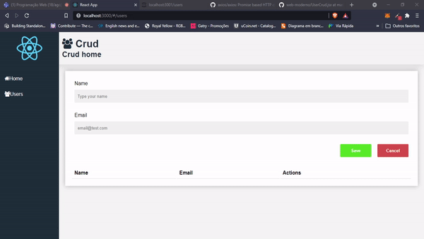

# <p align="center"> ReactJs Crud </p>
<br />

# 🐱‍👤 Sobre

Uma crud que utiliza as 4 operações, get, post, put
e delete, para realizar cadastros em um banco de dados
JSON local.<br />

<div align="center">

</div> <br />

# 🔧 Ferramentas

* <a href="https://reactjs.org/">ReactJs</a>

* <a href="https://code.visualstudio.com/">Visual Studio Code</a>

* <a href="https://www.npmjs.com/package/json-server">JSON-Server</a><br />

* <a href="https://www.npmjs.com/package/axios">Axios</a><br />

* <a href="https://fontawesome.com/">Font Awesome</a><br />

  

# 🎱 Atributos 

* Recebe os valores do usuário.

* Verifica os dados. 

* Salva a os dados.

* Edita, exclui ou cria um novo valor. <br/>

# 🏴‍☠️Como utilizar

  ```sh
$ git clone https://github.com/Scrowszinho/ReactJs-Crud
  ```

```sh
$ cd frontend
$ npm start
$ cd..
$ cd backend
$ npm start
```